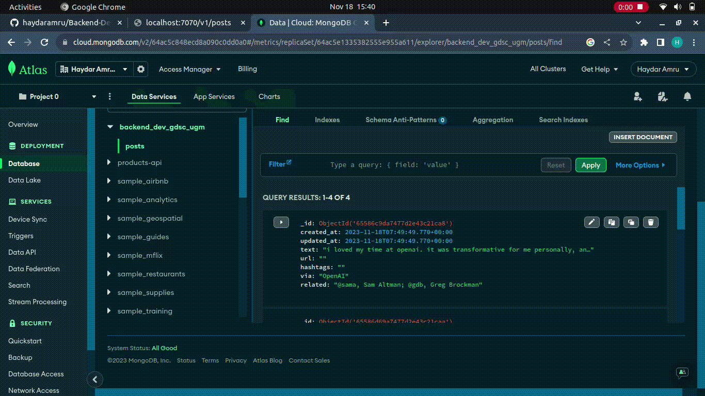

# (Deliverables) Backend Development Assignment GDSC UGM Hacker Role Member

In this project, I'm taking a shot at recreating my earlier Node.js TypeScript project, but with a twist—I'm diving into Golang and playing around with the Fiber web framework. I went with Fiber instead of Gin because of its lightweight nature and speed. Fiber is designed to be minimalistic yet powerful, making it a perfect fit for building efficient APIs. The idea is still to build a nifty CRUD API for posts (tweets) from X (formerly Twitter).

## Table of Contents
- [Introduction](#introduction)
- [API Endpoints](#api-endpoints)
- [Parameters](#parameters)
- [Getting Started](#getting-started)
- [Usage](#usage)
- [Examples](#examples)

## Introduction

In this case study, I aim to replicate the functionality of posting and managing tweets on the X platform. The API allows users to perform the following operations:

- **Create:** Post a new tweet with text, a URL, hashtags, a "via" source, and related content.
- **Read:** Retrieve tweets by their unique IDs or search for tweets using specific criteria.
- **Update:** Edit the content of an existing tweet.
- **Delete:** Remove a tweet from the platform.

This case study leverages the reference parameters provided by [X's developer documentation](https://developer.x.com/) to maintain consistency with the platform's standards.

## API Endpoints

The following API endpoints are available:

- `POST /v1/posts`: Create a new tweet.
- `GET /v1/posts`: Retrieve all tweets.
- `GET /v1/posts/:id`: Retrieve a tweet by its unique ID.
- `PUT /v1/posts/:id`: Update an existing tweet.
- `DELETE /v1/posts/:id`: Delete a tweet.

## Parameters

### Post (Tweet) Content Parameters

1. `text` (string)(required): The main content of the tweet.
2. `url` (string): A URL or link associated with the tweet.
3. `hashtags` (array of strings): An array of hashtags used in the tweet.
4. `via` (string): The source or platform from which the tweet is posted.
5. `related` (array of strings): An array of related content or users.

## Getting Started

To set up and run this CRUD API, you will need the following:

1. Node.js and npm installed.
2. .env files (see .env.example)
3. A database system (e.g., MongoDB) to store tweet data.
4. API development tools (e.g., Postman).

To get started, clone this repository and install the required dependencies:

```bash
npm install
npm start
```

## Usage

To use these API, make HTTP requests to the defined endpoints with the valid parameters. Ensure that your requests following reference parameter to maintain compatibility with X's post (tweet) structure.

## Examples

### Retrieve a Post

```http
GET http://localhost:7070/v1/posts
```

### Create A New Post

```http
POST http://localhost:7070/v1/posts

{
    "text": "Agar silaturahmi tidak terputus pinjam dulu seratus",
    "via": "UGM_FESS"
}
```


